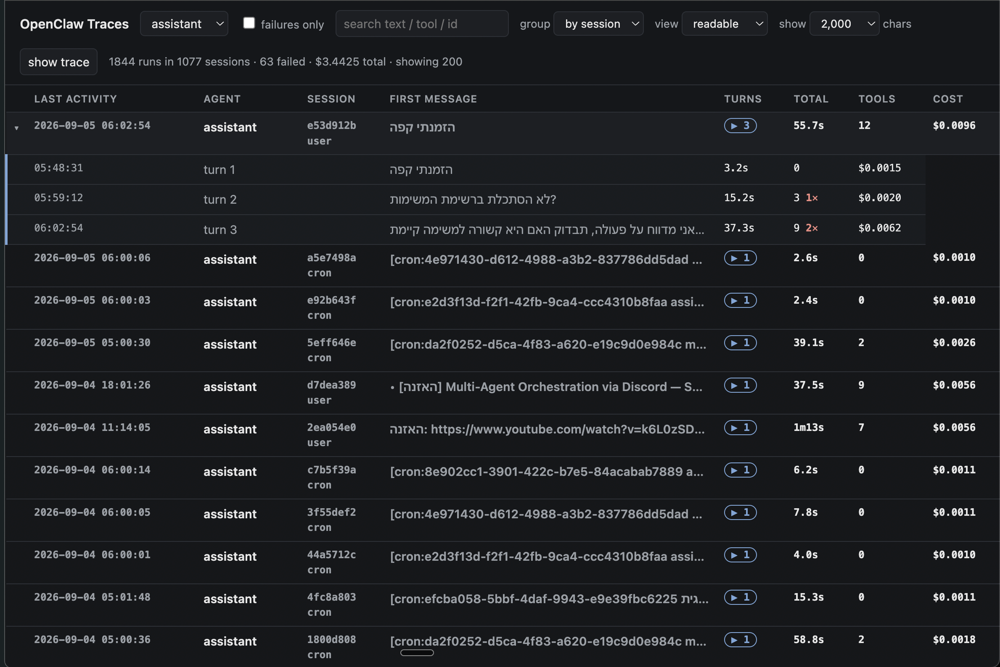
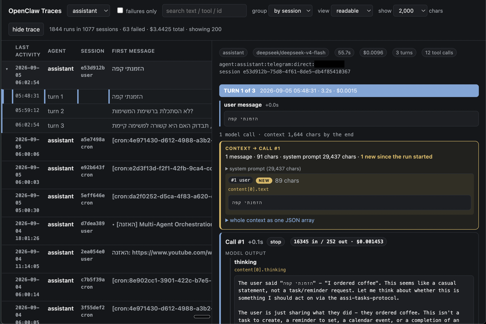

# openclaw-trace-viewer

A read-only trace viewer for [OpenClaw](https://openclaw.ai) agent runs — a
local, self-hosted answer to the question *"what did the model actually see,
and what did it actually do?"*

It reads the `*.trajectory.jsonl` files OpenClaw already writes to disk. No
plugin, no config change, no gateway restart, no telemetry backend. Nothing is
written to the agent runtime.



*Every run on disk, grouped by session. Expand a row to see its turns, with
per-turn duration, tool count, failed tool calls and cost.*



*Inside a turn: the complete context going into each model call, then the call
itself — thinking, output, tool calls and results — with the JSON key path for
every rendered value.*

Both screenshots are real runs from a live deployment, deliberately — the point
of the tool is what real traffic looks like. One Telegram user id is blacked
out; nothing else is altered.

---

## Why

OpenClaw records a lot per run, but reading it back means hand-assembling JSON
from disk. Doing that once is instructive; doing it per session is a chore. The
alternative — enabling the `diagnostics-otel` plugin and running a Langfuse-style
stack — needs a spare few GB of RAM, an explicit decision to copy prompt and
tool content into a second system, and it only records from the day you switch
it on. Every session already on disk stays invisible to it.

This reads the files that already exist. It covers the whole history from the
first run, and it can be deleted without leaving a trace on the deployment.

## What it shows

The point of the tool is the **context view**. For every model call in a run it
renders the complete conversation as it stood going into that call:

```
CONTEXT → Call #3
5 messages · 7,628 chars · system prompt 29,437 chars · 2 new since Call #2
▸ system prompt (29,437 chars)

  #1  user                        1,204 chars   ▸ show
  #2  assistant                   3,180 chars   ▸ show
  #3  toolResult · read           4,738 chars   ▸ show
  #4  assistant            [NEW]  2,102 chars
  #5  toolResult · memory_search  [NEW]    890 chars
▸ whole context as one JSON array
```

Messages added since the previous call are highlighted and open by default;
earlier ones stay collapsed so a 30-message context is still navigable. Each
turn closes with a **FINAL CONTEXT** block, so the last assistant message —
the one with `stopReason: "stop"` — is visible in context too.

Alongside each context sits the call itself: thinking blocks, the text sent to
the user, every `toolCall` with its arguments, and every `toolResult` with the
JSON key path each rendered value came from. A **raw** mode swaps the readable
rendering for the verbatim message JSON.

Two levels of granularity:

- **per run** — one user message and everything the agent did in response
- **full session trace** — every turn of a conversation, end to end, with
  `TURN N of M` markers

Anything over the display limit is truncated with a `show all N chars` expander,
so a 100 KB tool result doesn't blow up the page.

The list view groups runs by session, and sorts and filters by agent, model,
duration, cost, tokens and failure status.

## How it works

```
*.trajectory.jsonl  ──▶  index_traces.py  ──▶  traces.db  ──▶  serve.py  ──▶  browser
   (source of truth)        (one row per run)     (SQLite)      (loopback)
```

`index_traces.py` walks every trajectory file and writes one row per run:
when, which agent, model, duration, cost, tokens, tool count, final status.
Heavy content stays in the files and is re-read on demand — the corpus is
hundreds of MB and the largest single trajectory file is 10 MB, so an index
isn't an optimisation, it's a requirement.

`serve.py` serves the UI and re-parses individual runs out of their trajectory
file when you open one. It is a single file with no dependencies beyond the
Python standard library.

### What happens when you click a row

1. The browser asks for `/api/run/<run_id>`.
2. `serve.py` looks that run up in the index — one row, which includes the
   path of the trajectory file it came from.
3. It opens that file and reads only the lines belonging to that run, ignoring
   the rest. A 10 MB file with forty runs in it costs one pass, not forty.
4. From those lines it rebuilds the run: the system prompt and tool list out of
   `context.compiled`, the conversation out of `model.completed`, timing and
   final status out of `session.started` / `session.ended`.
5. It splits the conversation at each assistant message. Everything before one
   is the context that went *into* that model call; the message itself is the
   call's output; the tool results that follow are what came back.
6. The browser renders that as alternating context and call blocks.

The index holds only what a list row needs: metrics, status, tool names, plus
the first user message and last assistant reply for the preview column and the
search box. Everything else you read in the detail pane comes straight off disk
at the moment you ask for it — which is why redaction can be a runtime switch
rather than a rebuild, and why `traces.db` still counts as sensitive.

### One correctness detail worth knowing

`model.completed.messagesSnapshot` is **cumulative** — it holds the entire
conversation, not just the messages from that run. Summing usage across
snapshots naively double-counts every earlier turn. The indexer anchors on the
run's `session.started` timestamp and ignores anything stamped before it.
Getting this wrong inflated the cost total on the reference corpus from
**$3.44 to $6.47**.

## Requirements

Python 3.8+. Nothing else — no pip install, no `requirements.txt`.

## Usage

Build the index (read-only on the source):

```bash
python3 index_traces.py
# indexed 1077 files -> 1844 runs in 2.2s (0 file errors)
```

Serve it:

```bash
python3 serve.py
# trace viewer on http://127.0.0.1:8765
```

`serve.py` binds to loopback only, by design. To view a viewer running on a
remote server, forward the port over SSH rather than exposing it:

```bash
ssh -L 8765:127.0.0.1:8765 user@your-server 'cd ~/trace-viewer && python3 serve.py'
```

Then open `http://localhost:8765`. If a previous instance is still holding the
port, `serve.py` finds it and clears it rather than failing with
`Address already in use`.

### Configuration

All optional, all environment variables:

| Variable | Default | Meaning |
|---|---|---|
| `OPENCLAW_AGENTS_DIR` | `/root/.openclaw/agents` | Where OpenClaw keeps per-agent session data |
| `TRACE_DB` | `./traces.db` | Index location |
| `TRACE_SKIP_AGENTS` | *(none)* | Comma-separated agents to exclude from the index |
| `TRACE_REDACT` | *(off)* | Replace conversation content with placeholders — see below |
| `TRACE_HOST` | `127.0.0.1` | Bind address — changing this exposes conversation content |
| `TRACE_PORT` | `8765` | Port |

To index a copy pulled off a server instead of reading it in place:

```bash
OPENCLAW_AGENTS_DIR=./local-copy/agents python3 index_traces.py
```

### Redaction mode

For screenshots, demos and screen-shares:

```bash
TRACE_REDACT=1 python3 serve.py
```

Every piece of conversation content — user messages, system prompt, thinking
blocks, tool arguments, tool results, absolute paths — is replaced with
placeholder text of the same length, line count and indentation. A
`REDACTED — placeholder content` badge sits in the header so redacted output
can't be mistaken for real data.

What survives, because it's what the UI exists to show: timings, costs, token
counts, roles, tool names, `stopReason`, context growth, and the tool-call id
wiring. Ids are remapped consistently, so a `toolCallId` still visibly pairs
with the `toolCall` that produced it. Tool results that contain JSON are
redacted *inside* the JSON, so they still render as JSON.

The index is untouched — redaction happens at read time, so the same
`traces.db` serves both modes. Note that search still matches against the real
text, and session ids stay real because the UI uses them to fetch.

## Trajectory format

Each run writes seven events, in a fixed order:

| Event | Carries |
|---|---|
| `session.started` | run start; the anchor for the cumulative-snapshot fix |
| `trace.metadata` | trigger, workspace, session key |
| `context.compiled` | system prompt, tool definitions, the compiled message list |
| `prompt.submitted` | the user prompt |
| `model.completed` | `messagesSnapshot` — the whole conversation, with per-message usage and cost |
| `trace.artifacts` | `toolMetas`, failure taxonomy |
| `session.ended` | final status, duration |

The envelope on every line carries `traceId`, `sessionId`, `sessionKey`,
`runId`, `provider`, `modelId`, `seq` and `ts`. Verified uniform across the
reference corpus: `schemaVersion: 1` on every line, zero parse errors.

## Security model

The data this reads is as sensitive as it gets: complete conversation content,
system prompts, tool arguments and tool results, for every session on disk. The
design follows from that.

### It only listens to itself

`serve.py` binds to `127.0.0.1`. That address means *this machine only* — the
server accepts a connection from a program running on the same box, and from
nothing else. The machine can have a public IP, sit on the open internet, and
port 8765 is still unreachable from outside. Not firewalled off, not blocked
after the fact: the listening socket was never offered to the network.

So you reach it by tunnelling, which forwards a port on your laptop to a port
on the server through your existing SSH connection:

```bash
ssh -L 8765:127.0.0.1:8765 user@your-server 'cd ~/trace-viewer && python3 serve.py'
```

The traffic rides inside SSH. Nothing new is exposed.

### The SSH key is the authentication

The viewer has no login screen, and that is deliberate rather than unfinished.
Authentication protects a door that strangers can knock on; this door only
opens from inside the machine. To get inside you need SSH, and SSH already
proved who you are with your key. Adding a password on top would guard a
hallway that is already behind a locked front door.

The consequence, stated plainly: **anyone who can already log into that server
can read every conversation.** That is the same access they had before this
tool existed — the trajectory files were always readable to them — but the
viewer makes it convenient. If that matters for your deployment, run the viewer
on a copy of the files elsewhere instead.

### Nothing leaves the machine

- **No outbound network calls.** The viewer talks to no API and no service.
- **No external resources in the page.** No CDN, no web fonts, no analytics,
  no third-party JavaScript. The HTML, CSS and JS are one self-contained file,
  so nothing is fetched from anyone and nobody learns you opened it.
- **No dependencies.** Python standard library only, so there is no package
  supply chain to trust.

### It never writes to the agent runtime

`index_traces.py` opens trajectory files for reading and writes exactly one
thing: `traces.db`, next to the script. `serve.py` writes nothing at all. No
config is edited, no gateway restarted, no plugin installed. Deleting the two
scripts and the database leaves the deployment exactly as it was.

### Keep the index out of git

`traces.db` holds real conversation text. It is in `.gitignore`, and that line
should stay there.

For screenshots you have two options, and they are for different jobs. Publish
a real capture when the content is yours and mundane, and black out the few
identifiers that are not — that is what the images above do, and it shows what
real traffic actually looks like. Use `TRACE_REDACT=1` when the content is not
yours to publish, or when there is too much of it to check by eye. A black
rectangle is only as good as your review of the rest of the frame; redaction
does not depend on you spotting anything.

### What this does not protect against

Someone with a shell on the server, a stolen SSH key, or physical access to
the disk. None of those are made worse by this tool, and none are made better
by it. It is a reader, not a boundary.

## Status

Working and in use. Not packaged, not tested against OpenClaw versions other
than the one it was built against, and it assumes `schemaVersion: 1`.

Known gaps:

- Full-session traces are capped at 25 turns; longer sessions are truncated
  with a notice.
- No file watcher — re-run `index_traces.py` to pick up new sessions.

## License

MIT
